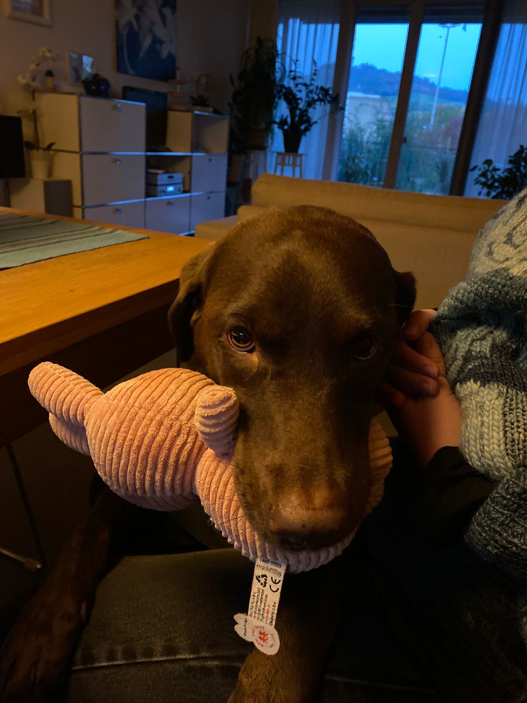
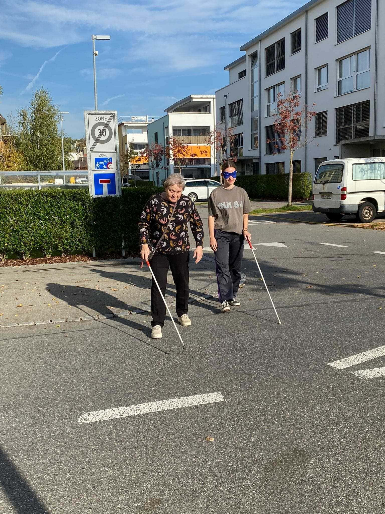
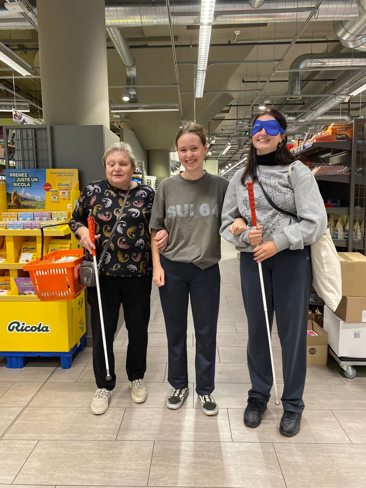
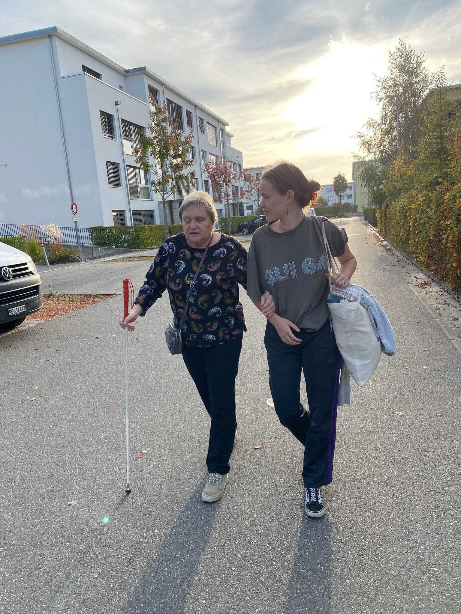

+++
title = "\"Akzeptanz ja, Integration nein\""
date = "2022-12-01"
draft = false
pinned = false
image = "repo.jpg"
description = "Eine Reportage über die gesellschaftliche Akzeptanz von blinden und sehbehinderten Menschen."
footnotes = "Autorinnen: Ava Howald und Nora Zimmermann"
+++


Wie gut sind blinde und sehbehinderte Menschen in unsere Gesellschaft integriert? Auf dem Weg zu Erkenntnissen tauchen wir in eine neue Welt ein: ein Selbstexperiment.



Es ist ein Mittwochnachmittag. Wir, Ava und Nora, sind auf dem Weg nach Ostermundigen zu Jolanda Gehri. Wir sind zwei junge Gymnasiastinnen, die sich für gesellschaftliche Themen interessieren. Beide haben jedoch keinen persönlichen Bezug zum Thema Blindheit. Wir gehen durch eine kleine Siedlung und suchen den Eingang zu ihrer Wohnung. Wir schauen uns im Wohnblock um und fragen einige Bewohner*innen, wo Jolanda Gehri wohnt. “Die Wohnung im ersten Stock», heisst es, «die mit den vielen Pflanzen gehört Jolanda». Schlussendlich stehen wir vor einer Tür und tatsächlich, Jolandas Eingangsbereich ist mit Pflanzen überfüllt. Neben der Klingel entdecken wir ein Schild. Darauf steht «Hier wohnt Ezra. Begrüssungsregeln für Besucher». Ezra ist Jolandas Blindenführhündin, wie sich gleich herausstellt. Es ist wichtig, sich bei ihr an bestimmte Regeln zu halten, deshalb stehen sie auch gleich auf dem Schild neben der Klingel. Eine Begrüssungsregel ist zum Beispiel, dass man Ezra nicht beachten oder direkt ansprechen soll. Denn Blindenführhunde dürfen nicht abgelenkt werden, wenn sie ein Führgeschirr tragen, damit sie ihre Arbeit konzentriert und sicher durchführen können.

Wir wissen, dass wir an der richtigen Tür stehen. Ava klingelt und wir hören Hundegebell. Nach einigen Sekunden öffnet sich die Tür, Jolanda und Ezra stehen vor uns. Beide begrüssen uns herzlich. Jolanda bittet uns hinein und wir setzen uns zu dritt an den Küchentisch. Ezra läuft uns währenddessen freudig um die Füsse.



In der Schweiz leben ungefähr 377'000 sehbehinderte Menschen. Dies macht vier Prozent der Schweizer Bevölkerung aus. Mehr als ein Viertel der Sehbehinderten ist über 80 Jahre alt und ab dem 90igsten Lebensjahr ist beinahe die Hälfte der Menschen sehbehindert. Denn der häufigste Grund für eine Sehbehinderung ist der Alterungsprozess. Unfälle oder Erkrankungen können weitere Ursachen dafür sein. Eine leichte Abnahme des Sehpotenzials im Laufe des Lebens ist jedoch natürlich.

Blindheit ab Geburt kommt bei Fehlentwicklungen, Gendefekten oder auch bei Infektionskrankheiten der Mutter während der Schwangerschaft vor.

Als sehbehindert gilt eine Person, wenn sie normalen Zeitungsdruck auch mit Brille nicht mehr lesen kann. Als blind gilt eine Person, die gar nichts sieht, aber auch jemand, der an Gesichtsfeldausfällen leidet.



## Akzeptanz und Integration

Wir beginnen uns besser kennenzulernen. Wir stellen uns vor und auch Jolanda erzählt kurz von ihrer Person. Jolanda ist 67 Jahre alt und engagiert sich beim Schweizerischen Blinden- und Sehbehindertenverband (SBV). Sie ist durch eine Rötelinfektion ihrer Mutter während der Schwangerschaft von Geburt an blind und hat ihre Schulzeit in der Blindenschule Zollikofen absolviert. Später absolvierte sie eine Lehre als Telefonistin in Basel und arbeitete nach langwieriger Arbeitssuche auch auf diesem Beruf. Sie ist Mutter von zwei erwachsenen Kindern und lebt seit 2000 mit einem Blindenführhund an ihrer Seite. Sie setzt sich für die Integration der Blinden ein, indem sie Sehende in die Welt der Blinden versetzt.

Während der nachfolgenden Fragerunde werden wir immer wieder von Ezra unterbrochen. Sie versucht, auf Noras Schoss zu klettern. Jolanda ist empört und amüsiert zugleich. “Ezra! Jetzt sei nicht so frech, sonst kommst du auf den Bauernhof!”, ruft sie. Jedoch merkt man dabei, wie sehr sie diesen Hund liebt.

Vor zwei Wochen hatten wir ein spannendes Interview mit Charly Meyer vom SBV. In dem Interview ging es vor allem um das Thema «Akzeptanz und Etablierung von blinden Menschen in unserer Gesellschaft». Durch das Interview konnten wir die Meinung einer Fachperson erhalten, die als nicht betroffene Person viel über das Thema weiss. Wir erzählen Jolanda davon und nun interessiert uns ihre Meinung zu diesem Thema.



Charly Meyer ist Sozialpädagoge und Mitarbeiter vom Generalsekretariat des Schweizerischen Blinden- und Sehbehindertenverbands und leitet die Abteilung für Schulungen und Sensibilisierung. Ausserdem ist er Spezialist für Low Vision und Mobilitätstrainer. Low Vision beinhaltet Strategien und Hilfsmittel zur Wiedererlernung des Lesens. Bevor er 2019 ins Generalsekretariat gekommen ist, leitete er ab 1994 die Beratungsstelle in Freiburg.



Jolanda stört es, dass ihr Umfeld sie als blinde Person in alltäglichen Dingen nicht einschliesst und auch nicht für spontane Aktivitäten anfragt. Sie sei akzeptiert, aber nicht integriert! Die Begründung sei jeweils, dass man nicht wisse, wie man sie einbeziehen könne. Jolanda versteht dies nicht, man müsse einfach auf die Personen zugehen. “Man muss einsehen, dass es einfach anders ist, aber nicht mehr Aufwand gibt”. Damit geht sie auf ein weiteres Argument von Menschen ein, welche behaupten, dass es zu anstrengend wäre, sich mit einer blinden Person zu beschäftigen. Denn auch dies bekommt sie oft zuhören.

Nicht nur im Privatleben, sondern auch im Arbeitsleben und bei der Jobsuche hat es Jolanda nicht einfach. Es bestehen immer noch viele Vorurteile. Arbeitgeber*innen fragen sich, ob eine blinde Person in der Lage sei, einen Job auszuführen oder auch, ob das Einbeziehen einer blinden Person wohl das Team stören würde. Dazu meint Jolanda: «Es ist einfach nur traurig, wenn man sowas fragen muss!» Sie glaubt nicht, dass sich die gesellschaftliche Akzeptanz in den letzten Jahren viel verbessert habe. «Wir sind immer noch weit von Integration entfernt», sagt sie. Doch gemäss Charly Meyer hat die Akzeptanz in den letzten 30 bis 40 Jahren zugenommen. Dazu sagt er auch: «Heutzutage sind blinde und sehbehinderte Personen mehr in der Öffentlichkeit und der Politik zu sehen. Früher sind sie noch zu Hause geblieben und sogar versteckt worden. Dadurch hat sich sicher auch viel verändert.» Auch er weiss aber, dass bis zu einer vollständigen Integration noch viel zu tun ist. Er betont auch, dass der SBV gerne mehr machen würde, es jedoch an Ressourcen fehle.

> "Früher sind sie noch versteckt worden"
>
> \-Charly Meyer

Auch bei der Frage, ob Aufklärung über Sehbehinderungen zu mehr Integration führen kann, sieht man die verschiedenen Schwerpunkte von Jolanda und Charly Meyer. Jedoch sind die beiden Schwerpunkte abhängig voneinander. Jolanda sagt, dass genug aufgeklärt werde und das Problem der fehlenden Integration nicht an der Aufklärung liege. Charly Meyer hingegen glaubt, dass man über die Aufklärung noch viel erreichen könne, weil einfach zu viele Personen ungenügend über Sehbehinderungen informiert seien.

Jolanda ist überzeugt, dass Selbsterfahrungen der beste Weg sind, um mit dem Thema der Akzeptanz und der Sensibilisierung weiterzukommen. Mit Aufklärung kommt man nicht mehr weiter, laut Jolanda. Selbsterfahrungen bringen nämlich viele Leute zu einer grundlegenden Erkenntnis. Um dies in ihren Worten auszudrücken: «Eigentlich sind das ja Menschen, wie wir auch, ihnen wurde nur der Rucksack anders gepackt». Damit wir unsere eigenen Erfahrungen sammeln, lässt sie uns gerade selbst in die Welt der Blinden eintauchen.

> "Uns wurde nur der Rucksack anders gepackt"
>
> \-Jolanda Gehri

## Orientierungslos auf dem Weg zu neuen Erkenntnisse

Das angeregte Gespräch neigt sich langsam dem Ende zu, doch der Nachmittag ist noch lange nicht beendet. Wir werden nun in unserem Selbstexperiment spüren, wie es ist, blind zu sein. Jolanda erklärt uns den Plan und wir werden ein wenig nervös. Nora erhält eine Dunkelbrille, damit sie nichts sehen kann und einen weissen Langstock für die Orientierung in die Hand gedrückt. Ava soll unterdessen auf Nora aufpassen. Wir machen uns auf den Weg in die Migros Ostermundigen, um dort einkaufen zu gehen. Auf halbem Weg und nochmals im Einkaufszentrum werden wir die Rollen tauschen.

Jolanda erklärt, wie man den weissen Stock bewegen muss, um das eigene Gehfeld abzudecken und verschiedene Oberflächen ertasten zu können. Der weisse Stock ist leider immer noch, ein zu wenig benutztes Hilfsmittel für den Strassenverkehr. Damit können blinde und sehbehinderte Menschen allfällige Hindernisse rechtzeitig erkennen und die Bodenbeschaffenheit erfühlen. Er dient auch zum eigenen Schutz. So weiss das Umfeld, dass die Person blind oder sehbehindert ist. Durch das Aufschlagen des Stocks am Boden können Blinde auch akustisch Informationen zur Topografie der Umgebung erlangen. Um dies zu erlernen, braucht es jedoch viel Training mit Fachpersonen.

Nora orientiert sich, indem sie den Stock immer wieder über eine Rinne am Strassenrand führt. Auf den Beinen geht sie noch etwas wacklig und sie fühlt sich unsicher. Hin und wieder fragt Jolanda, was Nora in ihrer unmittelbaren Umgebung bemerkt und was sie alles wahrnimmt. Nora muss jedes Mal ehrlicherweise zugeben, dass ihr nichts Spezielles auffällt. Auch dass unser Experiment Aufsehen erregt hat und eine Mutter mit ihrem Kind einige Minuten mitgelaufen ist, bemerkte Nora nicht. Wir kommen zu einer Kreuzung. Beim Überqueren der Strasse müssen Jolanda und Nora gut hinhören, zum Glück erkennt Jolanda sofort, wenn sich ein Auto nähert. Elektroautos machen das Ganze aber viel schwieriger, weil sie weniger laut sind. Jolanda hält ihren Stock hoch, damit die Autofahrer*innen wissen, dass wir die Strasse überqueren wollen und deshalb anhalten. Denn Menschen mit einem weissen Stock haben immer Vortritt, auch wenn es keinen Fussgängerstreifen hat.

Wir haben die halbe Strecke erreicht und die Rollen werden nun getauscht, dass auch Ava das Selbstexperiment durchführen kann. Ava wird durch die Dunkelbrille blind gemacht und Nora muss nun aufpassen. Ava geht es am Anfang ähnlich wie Nora. Sie muss sich auf andere Sachen als gewöhnlich konzentrieren und bemerkt im Gegensatz zu Jolanda nicht einmal, dass ein Bus neben ihr hält. Wir sind jetzt schon über eine Stunde unterwegs. Ava fragt, ob wir bald bei der Migros angekommen sind, was Jolanda bestätigt, schliesslich hört man ja schon das Rattern der Einkaufswagen. Im Einkaufszentrum erfahren wir, dass Jolanda beim Einkaufen auf Hilfe angewiesen ist. Sie wendet sich jeweils an den Kundendienst und bittet um Begleitung. Wichtig ist ihr dann, dass ihr möglichst viele Dinge gezeigt werden, da sie das Angebot nicht kennt. Wir können das Experiment auch ohne externe Person durchführen, da entweder Nora oder Ava, Jolanda und die jeweils nichtsehende Person am Arm halten kann. Zu dritt schlendern wir durch den Laden und arbeiten zuerst Noras und dann Avas Einkaufsliste ab.

In der Migros fallen uns besonders die verschiedenen Gerüche auf. Man kann zum Teil riechen, welche Lebensmittel sich um uns befinden. Trotzdem hat man alleine und ohne Training durch eine Fachperson keine Chance, sich im Einkaufsladen zu orientieren. Wir bezahlennd gehen zum Schluss noch Blumenerde für Jolandas Pflanzen kaufen.

## Gespräche und grosses Nachdenken

Auf dem Rückweg zu Jolandas Wohnung sind wir beide sehend und schätzen dieses Privileg. Jolanda hat sich bei Nora eingehakt und wir tauschen uns über das Erlebte aus.

Als erstes erzählt uns Jolanda, dass sie gerade stolz auf sich sei, weil sie das erste Mal ohne Hund den Weg in die Migros gefunden habe. Wir bemerken erneut, was für eine Herausforderung das Gehen einer Strecke für einen blinden Menschen darstellt. Jolanda kennt zwar sehr viele verschiedene Wege, aber diese musste sie alle zuerst mühsam erlernen. Den Weg zurück zu Jolandas Wohnung haben wir aber gut gefunden. Ezra erwartet uns schon freudig Zuhause. Wir verabschieden und bedanken uns bei Ezra und Jolanda und begeben uns auf den Weg zur Bushaltestelle.

Wir haben viel von Jolanda gelernt und für sehr kurze Zeit am eigenen Körper erfahren, wie es sich anfühlt, blind zu sein. Wir sind fasziniert von Jolandas geschärften Sinnen, mit denen sie so viel mehr wahrgenommen hat als wir. Obwohl für kurze Zeit blind, waren wir immer noch Ava und Nora. Die genau gleichen Menschen, nur – um in Jolandas Worten zu sprechen – mit einem anders gepackten Rucksack. Wir verstehen jetzt Jolanda nur zu gut. Wir verstehen, dass sie enttäuscht ist, wenn sie von ihren Mitmenschen nicht integriert wird, ihr gewisse Dinge nicht zutraut und sie deshalb schon gar nicht für Aktivitäten angefragt wird. Dabei ist es bereichernd, mit einer blinden Person unterwegs zu sein, ihre Hürden zu kennen, aber auch ihre Stärken zu schätzen. Schlussendlich sind wir alle einfach Menschen.